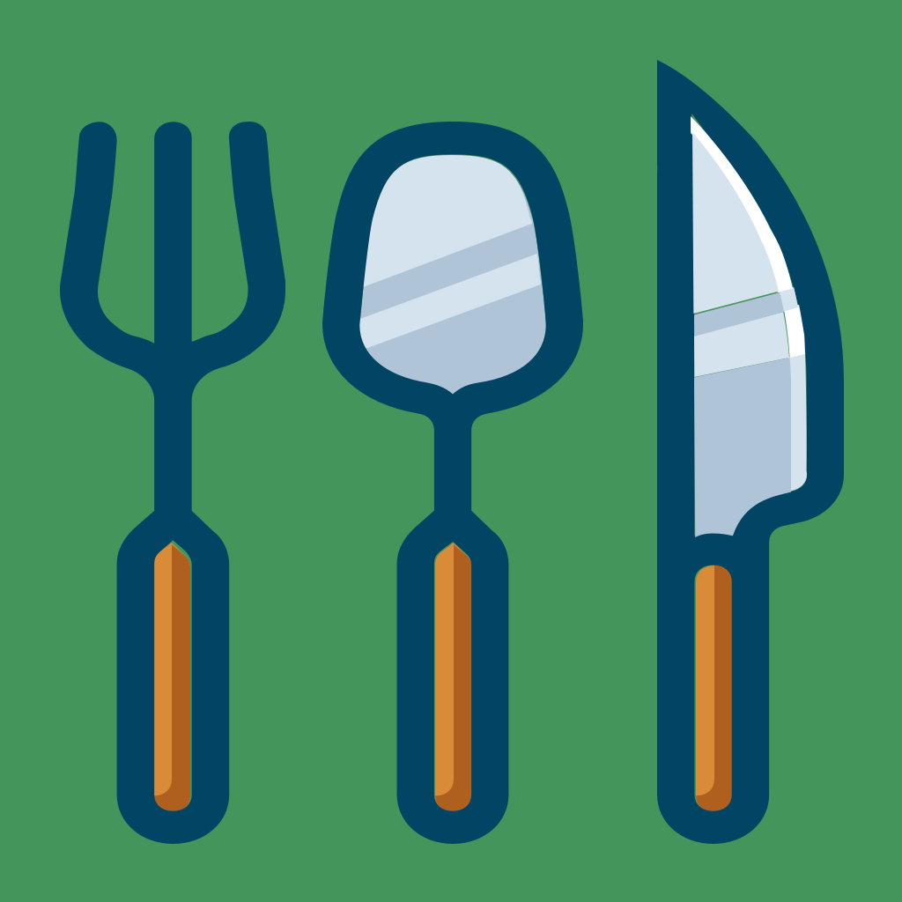
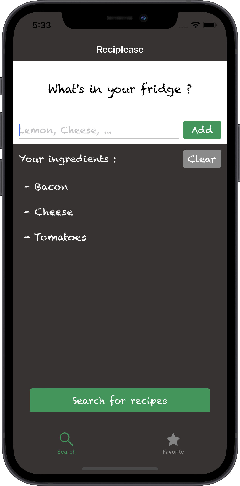
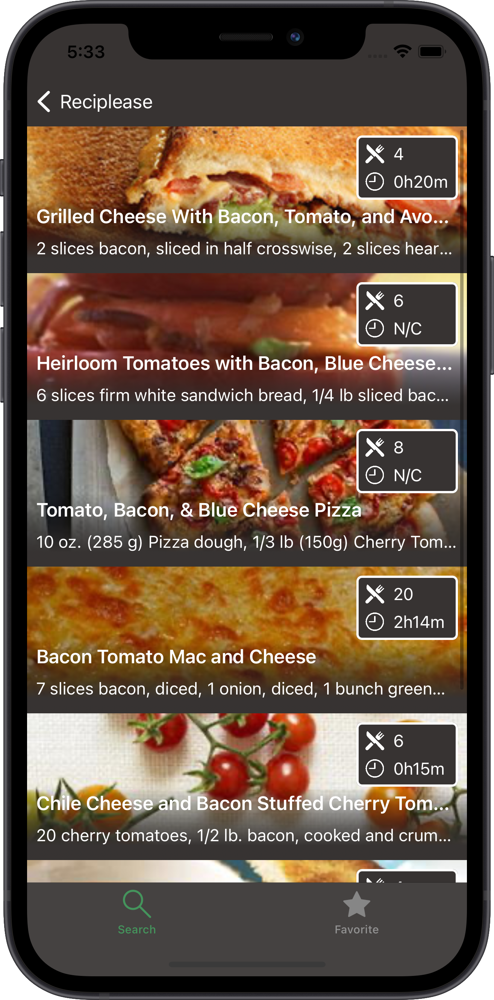
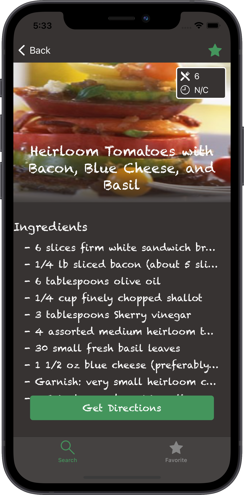
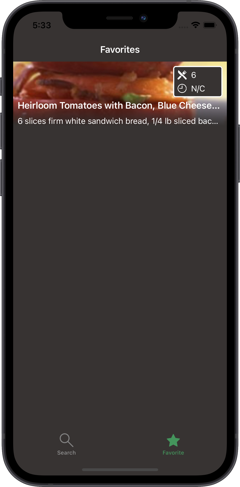

# Reciplease

<div align="center">
    
    <p>
    Reciplease is the fifth coded project of my training at OpenClassRooms.<br>
    If you wanna see the others, checkout my <a href="https://github.com/imick666/OpenClassRooms"> dedicated repo</a>
    </p>
</div>

## Sommary
- [Description](#description)
- [What I Learned](#what-i-learned)
- [How to use](#how-to-use)
- [Screenshots](#screenshots)

## Description

Reciplease is an app where you can easily find recipes from what you have in your fridge.  
Just enter ingredients you want to use and the app wil show you recipes you can make.

If you love one of them, you can store it on your phone for later, even offline.

## What I learned

- Core Data
- Cocoapods
- AlamoFire
- SDWebImage
- Delegate Patern

## How to use

This project use 1 api keys (that I don't share, it's mine ^^).

- [edamam.com](https://developer.edamam.com/edamam-docs-recipe-api)

Anywhere you want, create a file called "APIConfig.swift". Don't forget to add it to the target "Reciplease".

In this file, copy and paste the following code:

```Swift
struct APIConfig {
    static let appKey = "" // Paste your API Key here
    static let appId = "" // Paste your App ID here
}
```

Add your api key and App ID in the file and build the project.


## Screenshots

<div float="left">
    
    
    
    
</div>

## Sources

- App icon image: [freesvg.org](https://freesvg.org/kitchen-utensils) by OpenClipart


